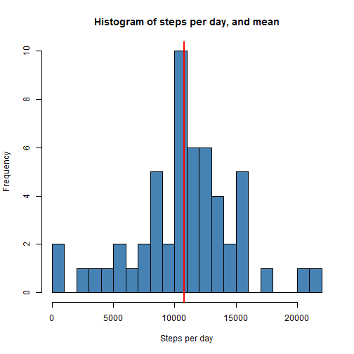
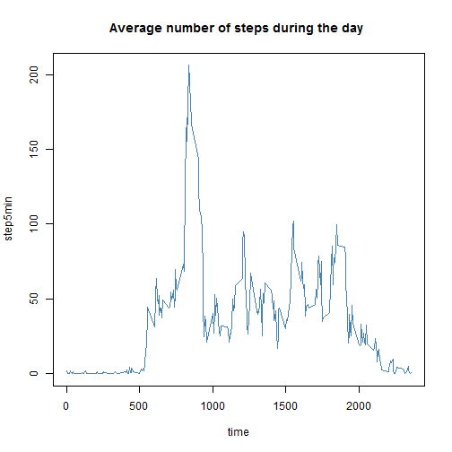
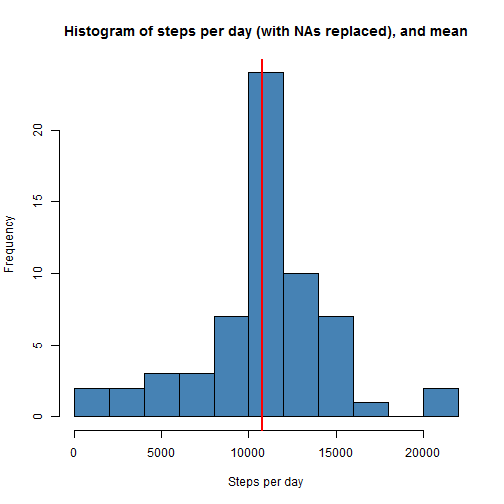
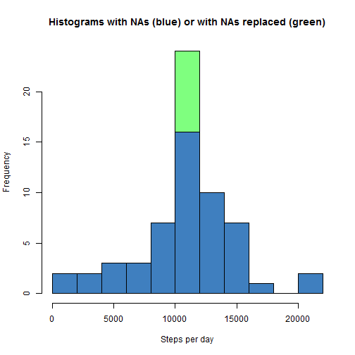
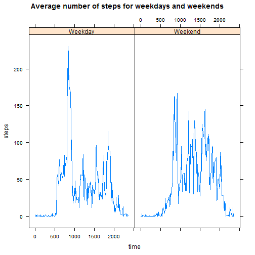

##1. First look at the data

First let's load the data (and some packages) and take a look at it. I also set the timezone to US, since I live on France, in order to get the right names for the weekdays, further down the line... Warning: this will be turned to .pdf directly by RStudio (not through the command line). The .md file will be created via the "knit" function through the command line.


```r
Sys.setlocale("LC_TIME", "English")
```

```
## [1] "English_United States.1252"
```

```r
library(knitr); library(lattice); library(utils)
download.file("https://d396qusza40orc.cloudfront.net/repdata%2Fdata%2Factivity.zip", "temp.zip", method="wininet")
data <- read.csv(unzip("temp.zip"), sep=",", header=T)
data$date <- as.Date(data$date)
summary(data)
```

```
##      steps             date               interval     
##  Min.   :  0.00   Min.   :2012-10-01   Min.   :   0.0  
##  1st Qu.:  0.00   1st Qu.:2012-10-16   1st Qu.: 588.8  
##  Median :  0.00   Median :2012-10-31   Median :1177.5  
##  Mean   : 37.38   Mean   :2012-10-31   Mean   :1177.5  
##  3rd Qu.: 12.00   3rd Qu.:2012-11-15   3rd Qu.:1766.2  
##  Max.   :806.00   Max.   :2012-11-30   Max.   :2355.0  
##  NA's   :2304
```

Now let's calculate the total number of steps per day on the two months of the data available. We put the summed data in **"stepday"** and take a look at its histogram. The mean number of steps per day appears as a red vertical line.


```r
stepday <- sapply(split(data$steps, data$date), sum)
hist(stepday, breaks=20, col="steelblue", main="Histogram of steps per day, and mean", xlab="Steps per day")
abline(v=mean(stepday, na.rm=T), col="red", lwd=2)
```

 

The mean and median numbers of steps per day is given in the following table:


```r
rbind(c("Mean", "Median"), c(round(mean(stepday, na.rm=T), 2), median(stepday, na.rm=T)))
```

```
##      [,1]       [,2]    
## [1,] "Mean"     "Median"
## [2,] "10766.19" "10765"
```

##2. Average daily activity

The average daily acivity is now calculated by 5min intervals over the two months period. The following graph presents this activity as a function of the hour (by 5min intervals).


```r
step5min <- sapply(split(data$steps, data$interval), function(x) mean(x, na.rm=T))
time=data$interval[1:288]
plot(time, step5min, type="l", col="steelblue", main="Average number of steps during the day ")
```

 

The maximum number of steps and the corresponding time interval are:


```r
rbind(c("Max", "Max @ Time"), c(round(max(step5min), 2), 
        data$interval[as.numeric(which(step5min==max(step5min)))]))
```

```
##      [,1]     [,2]        
## [1,] "Max"    "Max @ Time"
## [2,] "206.17" "835"
```

This means that the maximum number of steps is taken on average **between 8:35am and 8:40am**.

##3. Taking the NAs into account

Until now, we worked with a lot (2304) of missing values. Since it's sometimes problematic to work with NAs (in the case of paired data, for example), one must often replace them with "numeric" values. The trick is that these new values must not add false, parasitic informations that could change the "meaning" of the original data. The replacement must be as transparent as possible.

To replace them, we will therefore use the average number of steps calculated over the two months period for each 5min interval calculated before. Each missing value will then be replaced by the average number of steps for the corresponding 5min interval. The result is a new dataset called **"dataNA"**. 


```r
repl <- data.frame(time, step5min=step5min)
dataNA <- data
for (i in 1:dim(dataNA)[1]) {
        if (is.na(dataNA$steps[i])==T) {
                dataNA$steps[i] <- repl[repl$time==dataNA$interval[i],2]
}}
```

From this new dataset, we calculate the total number of steps per day on the two months of the data available, whith the NAs replaced. We put the summed data in **"stepdayNA"** and take a look at its histogram. The mean number of steps per day appears as a red vertical line.


```r
stepdayNA <- sapply(split(dataNA$steps, dataNA$date), sum)
hist(stepdayNA, breaks=15, col="steelblue", main="Histogram of steps per day (with NAs replaced), and mean", xlab="Steps per day")
abline(v=mean(stepdayNA), col="red", lwd=2)
```

 

The mean and median numbers of steps per day -with NAs replaced- is given in the following table:


```r
rbind(c("Mean", "Median"), c(round(mean(stepdayNA), 2), round(median(stepdayNA), 2)))
```

```
##      [,1]       [,2]      
## [1,] "Mean"     "Median"  
## [2,] "10766.19" "10766.19"
```

If we superpose the histograms with and without replacement of the NAs, we obtain this figure:


```r
hist(stepdayNA, breaks=15, col=rgb(0,1,0,.5), main="Histograms with NAs (blue) or with NAs replaced (green)", xlab="Steps per day")
hist(stepday, breaks=15, col=rgb(0,0,1,.5), add=T)
```

 

We see that the only difference lies in the frequency of the mean steps per day value, and not on its value, as could be seen by the comparison of the means of **"stepday"** and **"stepdayNA"**. This could be interpreted as an "overrepresentation" of the mean in the nex dataset, which is logical given our replacement strategy.

In fact, the total number of steps of the dataset has increased with the replacement of NAs, in the proportions stated below:


```r
diff <- round(sum(dataNA$steps) - sum(data$steps, na.rm=T), 2)
rapp <- round(100*diff / sum(dataNA$steps), 2)
rbind(c("Absolute difference (steps)", "Relative difference (%)"), c(diff, rapp))
```

```
##      [,1]                          [,2]                     
## [1,] "Absolute difference (steps)" "Relative difference (%)"
## [2,] "86129.51"                    "13.11"
```


##4. Taking the days of the week into account

Since our daily activities usually change between weekdays and weekend days, it seems logical to study the influence of this factor on the number of steps taken. Depending on the day of the week, we will add a new column to the **"dataNA"**" dataframe containing "weekend" if on a saturday or sunday and "weekday" otherwise.


```r
dataNA$weekday <- weekdays(dataNA$date)
for (i in 1:dim(dataNA)[1]) {
        if (dataNA$weekday[i]=="Saturday" | dataNA$weekday[i]=="Sunday") {
                dataNA$weekday[i] <- "weekend"} else {
                dataNA$weekday[i] <- "weekday"
}}
dataNA$weekday <- factor(dataNA$weekday)
```

Now let's take a look at the daily activity for both weekdays and weekend days:


```r
step5minday <- sapply(split(dataNA[dataNA$weekday=="weekday",]$steps, 
                            dataNA[dataNA$weekday=="weekday",]$interval), mean)
step5minend <- sapply(split(dataNA[dataNA$weekday=="weekend",]$steps, 
                            dataNA[dataNA$weekday=="weekend",]$interval), mean)
temp <- data.frame(c(time,time), c(step5minday, step5minend), c(rep("Weekday", 288), rep("Weekend", 288)))
names(temp) <- c("time", "steps", "weekday")
xyplot(temp$steps ~ temp$time | temp$weekday, type="l", main="Average number of steps for weekdays and weekends", xlab="time", ylab="steps")
```

 

We can see that there is a difference in the pattern of activity between weekdays and weekend days. We can quantify it by calculating the difference weekend-weekday: 


```r
diff <- round(sum(step5minend) - sum(step5minday), 2)
rapp <- round(100*diff / sum(step5minday), 2)
rbind(c("Absolute difference (steps)", "Relative difference (%)"), c(diff, rapp))
```

```
##      [,1]                          [,2]                     
## [1,] "Absolute difference (steps)" "Relative difference (%)"
## [2,] "1945.68"                     "18.97"
```

On average, we take about 19% (~2000) more steps on weekend days than on weekdays: time to walk to work instead of taking our car...

